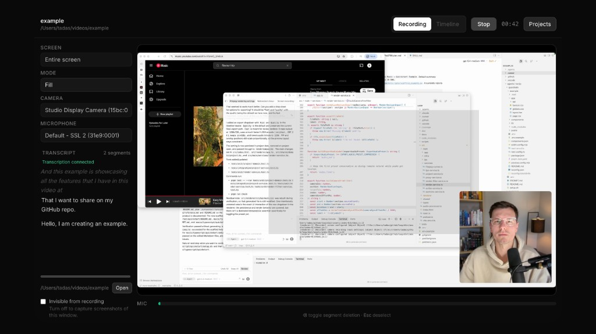
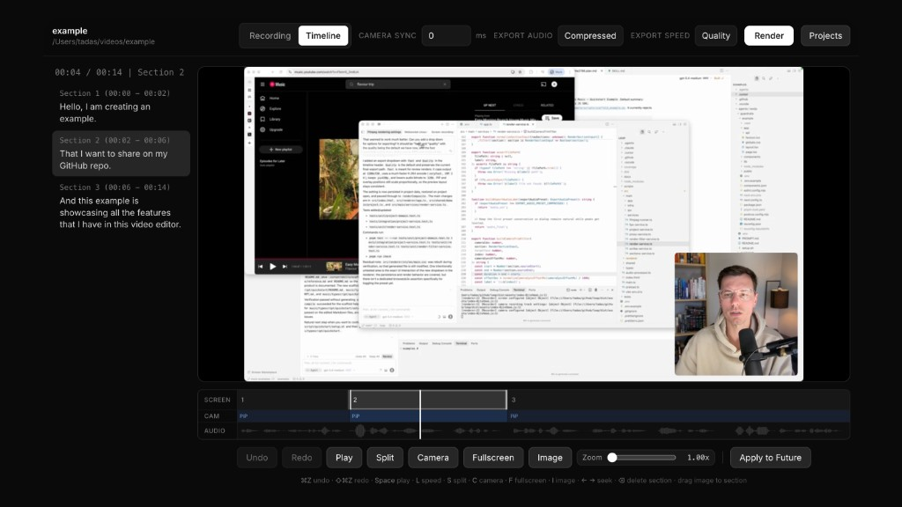

# loop

loop is a desktop app for recording screen-based videos, transcribing speech in real time, cutting dead space from the transcript, and turning raw takes into a clean edited MP4.

<p align="center">
  
  
</p>

<p align="center">
  <em>Recording view on the left, transcript-driven timeline editing on the right.</em>
</p>

The goal: I want to focus 100% of my time on the the video content and have AI take care of the rest.

Built with Electron, ffmpeg, and ElevenLabs Scribe, loop keeps the editing loop short: record, trim by speech, adjust the timeline, render.

## What loop Does

- Records screen, microphone, and optional camera together.
- Shows a live composite preview while recording.
- Generates a realtime transcript during capture.
- Lets you remove unwanted transcript segments before the first edit pass.
- Builds timeline sections automatically from spoken content.
- Provides a timeline editor for split, trim, undo/redo, playback, and section-level camera layout changes.
- Lets you apply a per-project camera sync offset when facecam video arrives slightly late.
- Renders the final video with ffmpeg, including camera picture-in-picture or fullscreen transitions.
- Saves work as project data so recording sessions can be resumed and re-edited.

## Why It Exists

Most screen recording workflows split recording and editing across different tools. loop combines them into one app:

- capture the take
- review the transcript
- remove filler and silence
- tighten the timeline
- export a finished video

That makes it especially useful for demos, tutorials, walkthroughs, and talking-head screen recordings where the spoken track should drive the edit.

## Core Workflow

1. Create or open a project.
2. Pick a screen source, camera, and microphone.
3. Record while loop builds a live transcript.
4. Remove transcript segments you do not want included.
5. Let loop compute timeline sections from speech.
6. Refine the result in the timeline editor.
7. Render the final MP4.

## Highlights

### Speech-first editing

Transcript cleanup is part of the editing flow, not a separate afterthought. loop uses transcript segments to build the first cut automatically.

### Timeline editing after auto-trim

Automatic section building is just the starting point. You can still:

- split sections
- trim section boundaries
- delete sections
- undo and redo edits
- seek and preview across section boundaries

### Camera composition controls

loop supports screen-only output, picture-in-picture camera, and fullscreen camera moments. Camera layout can be changed over time with section keyframes, and the timeline header includes a camera sync offset for delayed capture devices such as HDMI capture dongles.

### Project-based workflow

Projects store timeline state, takes, and settings so you can come back later instead of treating each recording as a one-off export.

## Tech Stack

- Electron for the desktop app shell
- ffmpeg via `ffmpeg-static` for final rendering
- ElevenLabs Scribe for realtime transcription token generation
- Tailwind CSS for styling
- Vitest for unit and integration tests

## Getting Started

### Requirements

- Node.js 22
- pnpm 10

### Install

```bash
pnpm install --frozen-lockfile
```

### Configure environment

loop needs an ElevenLabs API key to mint realtime Scribe tokens.

```bash
cp .env.example .env
```

Then set:

```bash
ELEVENLABS_API_KEY=your_key_here
```

### Run the app

```bash
pnpm dev
```

For a regular local launch:

```bash
pnpm start
```

## Verification

Use the full repo validation before opening a pull request:

```bash
pnpm run check
```

That runs:

- style build
- lint
- typecheck
- unit and integration tests
- Electron smoke test
- packaging smoke test

Useful individual commands:

```bash
pnpm run lint
pnpm run typecheck
pnpm run test
pnpm run test:e2e
pnpm run package:smoke
```

## Repository Guide

- `src/main/`: Electron main-process bootstrapping, IPC, and services
- `src/renderer/`: renderer app code and feature logic
- `src/shared/`: shared domain logic and normalization helpers
- `tests/unit/`: pure logic tests
- `tests/integration/`: service and filesystem integration tests
- `tests/e2e/`: Electron smoke coverage

More detailed internal docs:

- `docs/production/feature-inventory.md`
- `docs/production/target-architecture.md`
- `docs/production/runbook.md`

## Current Scope

loop already covers the full capture-to-render loop for transcript-driven screen videos, including:

- project creation and reopening
- recent project history
- pending recording recovery
- transcript cleanup
- automatic section building
- timeline editing
- MP4 export

## Contributing

Contributions are welcome.

Before submitting changes:

1. Keep changes focused and behavior-driven.
2. Add or update tests when behavior changes.
3. Run `pnpm run check`.

This repository treats production readiness seriously. If you change behavior, the expectation is that the tests prove it.

## License

Licensed under `Apache-2.0`. See `LICENSE`.

## Notes

- Realtime transcription requires `ELEVENLABS_API_KEY`.
- Project files and captured media are stored locally.
- Final renders are produced through ffmpeg.

## Status

This project is being prepared for open source release and the repository is moving to `tadaspetra/loop`.
