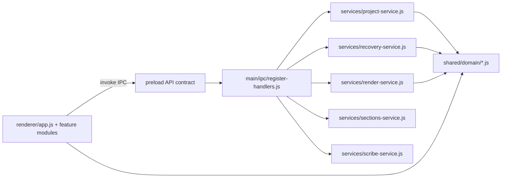

# Target Architecture

## Goals

- Separate concerns between Electron runtime, domain rules, renderer UI, and infrastructure.
- Keep feature behavior stable while making each layer independently testable.
- Make new features appendable without touching unrelated modules.

## Module Layout

```text
src/
  main/
    app/
      create-window.js
      lifecycle.js
    ipc/
      register-handlers.js
    services/
      project-service.js
      recovery-service.js
      render-service.js
      sections-service.js
      scribe-service.js
      media-service.js
    infra/
      file-system.js
      process-runner.js
  renderer/
    app.js
    constants/
      index.js
    features/
      transcript/
        transcript-utils.js
      timeline/
        section-utils.js
        keyframe-utils.js
    services/
      electron-api.js
      project-session.js
    styles/
      tailwind.input.css
      tailwind.css
  shared/
    domain/
      project.js
      timeline.js
      transcript.js
```

## Runtime Boundaries



## Migration Strategy

1. Introduce shared domain modules and reuse them from main process first.
2. Move IPC logic out of `src/main.js` into `src/main/ipc/register-handlers.js` with thin handlers.
3. Move project/recovery/render/section/token logic into service modules and unit test each.
4. Move renderer inline script to `src/renderer/app.js`.
5. Extract renderer pure helpers (transcript/section/keyframe utils) into `src/renderer/features/*`.
6. Harden security/tooling (local CSS assets, tighter CSP, config validation, CI checks).

## Test Matrix By Layer

- **shared/domain**: pure unit tests (normalization, timelines, text cleanup).
- **main/services**: unit + integration (filesystem/project/recovery/ffmpeg arg construction).
- **main/ipc**: integration tests with mocked Electron bindings.
- **renderer/features**: jsdom unit tests for pure view-independent logic.
- **e2e smoke**: Electron app launch, core navigation, project open/create path.
